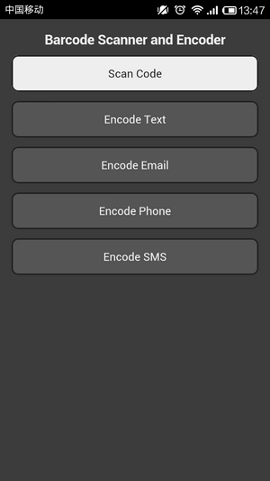
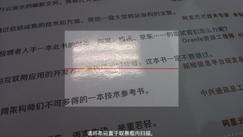
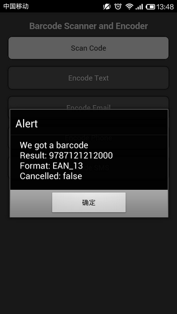
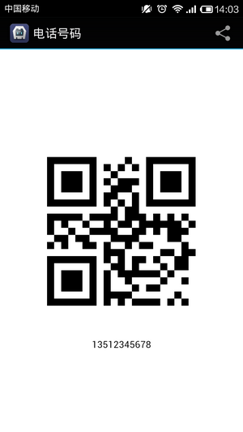

# Cordova 3.x 实用插件（2） -- 二维码 Barcode

**引用**

> 这个插件采用的是开源版的 zxing，如果性能、识别率不满足需求的话，建议使用 Scandit，它提供了 Community SDK，并且支持 Platforms（iOS/Android）、Frameworks（Titanium/Xamarin/Phonegap/Worklight）。其中 Community 版的支持 UPC-A / UPC-E、EAN8 / EAN13、QR Code。

插件地址：[https://github.com/wildabeast/BarcodeScanner](https://github.com/wildabeast/BarcodeScanner) 

**（1）创建工程** 

**引用**

```
cordova create HelloBarcode com.rensanning.cordova HelloBarcode 
cd HelloBarcode 
cordova platform add android
```

**（2）安装 plugin** 

**引用**

```
cordova plugin add https://github.com/wildabeast/BarcodeScanner.git
```

**（3）修改 index.html 后编译执行** 



**Html 代码**

```
<a href="#" class="btn" onclick="scanCode();">Scan Code</a>
<script type="text/javascript">
function scanCode() {
    cordova.plugins.barcodeScanner.scan(
      function (result) {
          alert("We got a barcode\n" +
                "Result: " + result.text + "\n" +
                "Format: " + result.format + "\n" +
                "Cancelled: " + result.cancelled);
      }, 
      function (error) {
          alert("Scanning failed: " + error);
      }
   );
}
</script>
```





Android 版本的 Zxing 插件默认是横向扫描的，竖向扫码需要修改插件的代码。这里有改好的，可以试试。[com.phonegap.plugins.barcodescanner.rar](http://dl.iteye.com/topics/download/d3b82782-506f-3e21-bec3-157e883713a5) 

Html **代码**

```
<a href="#" class="btn enc" onclick="encodeText();">Encode Text</a>
<script type="text/javascript">
function encodeText() {
    cordova.plugins.barcodeScanner.encode(
      "TEXT_TYPE", 
      "http://www.baidu.com", 
      function(success) {
        alert("encode success: " + success);
      }, function(fail) {
        alert("encoding failed: " + fail);
      }
    );
}
</script>
```


Html **代码**

```
<a href="#" class="btn enc" onclick="encodeEmail();">Encode Email</a>
<script type="text/javascript">
function encodeEmail() {
    cordova.plugins.barcodeScanner.encode(
      "EMAIL_TYPE", 
      "rensanning@gmail.com", 
      function(success) {
        alert("encode success: " + success);
      }, function(fail) {
        alert("encoding failed: " + fail);
      }
    );
}
</script>
```


Html **代码**

```
<a href="#" class="btn enc" onclick="encodePhone();">Encode Phone</a>
<script type="text/javascript">
function encodePhone() {
    cordova.plugins.barcodeScanner.encode(
      "PHONE_TYPE", 
      "135-1234-5678", 
      function(success) {
        alert("encode success: " + success);
      }, function(fail) {
        alert("encoding failed: " + fail);
      }
    );
}
</script>
```



Html **代码**

```
<a href="#" class="btn enc" onclick="encodeSMS();">Encode SMS</a>
<script type="text/javascript">
function encodeSMS() {
    cordova.plugins.barcodeScanner.encode(
      "SMS_TYPE", 
      "An important message for someone.", 
      function(success) {
        alert("encode success: " + success);
      }, function(fail) {
        alert("encoding failed: " + fail);
      }
    );
}
</script>
```


注意： 

a) 没有实现 CONTACT_TYPE 和 LOCATION_TYPE 的 encode。   
b) 如果 encode 出错：

Java **代码**

```
java.lang.NullPointerException
   at com.google.zxing.client.android.encode.EncodeActivity.onCreateOptionsMenu(EncodeActivity.java:89)
```

下载最新的 [encode.xml](http://zxing.googlecode.com/svn/trunk/android/res/menu/encode.xml) 文件，覆盖 platforms\android\res\menu\encode.xml 

Xml **代码** 

```
<menu xmlns:android="http://schemas.android.com/apk/res/android">
  <item android:id="@+id/menu_share"
        android:title="@string/menu_share"
        android:icon="@android:drawable/ic_menu_share"
        android:orderInCategory="1"
        android:showAsAction="withText|ifRoom"/>
  <item android:id="@+id/menu_encode"
        android:title="@string/menu_encode_vcard"
        android:icon="@android:drawable/ic_menu_sort_alphabetically"
        android:orderInCategory="2"
        android:showAsAction="withText|ifRoom"/>
</menu>
```

