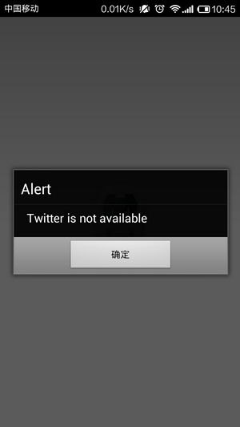
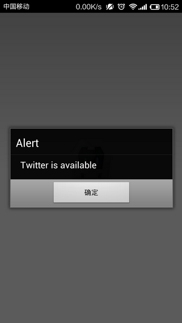

# Cordova 3.x 实用插件（6） -- 检查 APP 是否被安装

应用中经常要启动其他应用，比如：打开市场为自己的应用打分、强制用户更新应用、强制 Chrome 打开网页等等。在调用之前，你有必要知道要调用的应用是否在机器上已经安装。（很多通过 URL Scheme 启动的应用如果没有安装的话就没有任何提示） 

这个插件很小，也很简单，但是还是比较实用的。在 Android 环境下它通 PackageManager 来检查 ID 是否存在，在 iOS 环境下通过 canOpenURL 检查机器是否安装了该应用。 

插件地址：[https://github.com/ohh2ahh/AppAvailability](https://github.com/ohh2ahh/AppAvailability) 

（1）创建工程 

**引用**

```
cordova create AppAvailability com.rensanning.cordova AppAvailability 
cd AppAvailability 
cordova platform add android
```

（2）安装 plugin 

**引用**

```
cordova plugin add org.apache.cordova.device 
cordova plugin add https://github.com/ohh2ahh/AppAvailability.git
```

（3）修改代码 

Js **代码**

```
if (device.platform.toLowerCase() == 'ios') {
    appAvailability.check(
        'twitter://', // URI Scheme
        function() {  // Success callback
            alert('Twitter is available');
        },
        function() {  // Error callback
            alert('Twitter is not available');
        }
    );
}

if (device.platform.toLowerCase() == 'android') {
    appAvailability.check(
        'com.twitter.android', // URI Scheme
        function() {           // Success callback
            alert('Twitter is available');
        },
        function() {           // Error callback
            alert('Twitter is not available');
        }
    );
}
```

（4）编译后安装到手机上 

**引用**

```
cordova build
```




