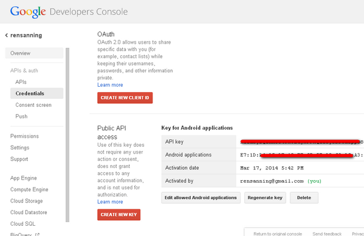
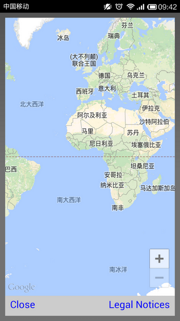
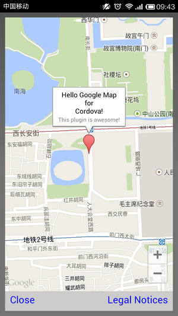

# Cordova 3.x 实用插件（1） -- Google 地图 Maps

插件地址：[https://github.com/wf9a5m75/phonegap-googlemaps-plugin/](https://github.com/wf9a5m75/phonegap-googlemaps-plugin/) 

**(1)创建工程** 

**引用**

```
cordova create HelloMap com.rensanning.cordova HelloMap 
cd HelloMap 
cordova platform add android
```


**(2)创建 Google Play Services 的 lib** 

**引用**

```
cd D:\android-sdk\extras\google\google_play_services\libproject\google-play-services_lib 
android update lib-project -p . -t 1 
ant clean
```

**(3)链接 Google Play Services** 

**引用**

```
cd E:\projects\HelloMap 
cd platforms/android/ 
android update project -p . -l ../../../google-play-services_lib
```

-l 只能使用相对路径，所以先要把 google-play-services_lib 拷贝到和 HelloMap 同一目录下。 

链接成功后 project.properties 文件中： 

**引用**

```
android.library.reference.2=../../../google-play-services_lib
```

**(4)获取 fingerpring** 

**引用**

```
keytool -list -v -keystore "%USERPROFILE%\.android\debug.keystore" -alias androiddebugkey -storepass android -keypass android
```

**(5)获取 API Key** 

进入 [Google APIs Console](https://code.google.com/apis/console/)   
打开 APIs & auth > APIs 把 Google Maps Android API v2的状态设置成 ON。   
进入 APIs & auth > Credentials > CREATE NEW KEY > Android Key > 输入 SHA1码+“；”+包名 > Create > 获取 API Key。 




**（6）安装 phonegap-googlemaps-plugin**

下载 [https://github.com/wf9a5m75/phonegap-googlemaps-plugin/archive/master.zip](https://github.com/wf9a5m75/phonegap-googlemaps-plugin/archive/master.zip) 

**引用**

```
cordova plugin add E:\plugins\phonegap-googlemaps-plugin-master --variable API_KEY_FOR_ANDROID=<上边的APIKEY> --variable API_KEY_FOR_IOS=<任意字符>
```

**（7）修改 index.html** 

Html **代码**

```
<button id="button" onclick="openGoogleMap();">Init a map</button>
<script type="text/javascript">
    function openGoogleMap() {
      var map = plugin.google.maps.Map.getMap();
      map.addEventListener(plugin.google.maps.event.MAP_READY, function(map) {
        map.showDialog();
      });
    }
</script>
```


**（8）编译执行** 

**引用**

```
cordova build android 
cordova emulate
```



小米等一些国内厂商手机上默认没有 Google Play Services，所以会出错： 

**引用**

```
java.lang.NoClassDefFoundError: com.google.android.gms.R$string
```

需要先上国内的其他应用商店里下载 Google Play Services。 

**（9）其他用法** 

Html **代码**

```
<button id="button" onclick="openGoogleMap2();">Init a map</button>
<script type="text/javascript">
    function openGoogleMap2() {
      var GOOGLE = new plugin.google.maps.LatLng(39.905841, 116.391596);
      var map = plugin.google.maps.Map.getMap();
      map.addEventListener(plugin.google.maps.event.MAP_READY, function(map) {
        map.showDialog();
        map.addMarker({
          'position': GOOGLE,
          'title': ["Hello Google Map", "for", "Cordova!"].join("\n"),
          'snippet': "This plugin is awesome!"
        }, function(marker) {
          map.animateCamera({
            'target': GOOGLE,
            'zoom': 15
          }, function() {
            marker.showInfoWindow();
          });
        });
      });
    }
</script>
```



**标记** 

Js **代码**

```
map.addMarker({
  "position": GOOGLE,
  "title": "Hello GoogleMap for Cordova!"
});
```

**Flat 标记** 

Js **代码**

```
map.addMarker({
  'position': GOOGLE,
  'flat': true
});
```

**获取标记（回调函数）** 

Js **代码**

```
map.addMarker({
  "position": GOOGLE,
  "title": "Hello GoogleMap for Cordova!"
}, function(marker) {
  marker.showInfoWindow();
});
```

**替换标记图标** 

Js **代码**

```
map.addMarker({
  'position': GOOGLE,
  'title': 'Google!'
  'icon': 'www/images/google_icon.png'
});
map.addMarker({
  'position': GOOGLE,
  'title': 'Google!',
  'icon': {
    'url': 'www/images/google_icon.png',
    'size': {
      'width': 74,
      'height': 126
    }
  }
});
```

**HTML5/Canvas 动态标记** 

Js **代码** 

```
var canvas = document.getElementById("canvas");
map.addMarker({
  'position': GOOGLE,
  'title': canvas.toDataURL(),
  'icon': "data:image/png;base64,iVBORw0KGgoA...",
}, function(marker) {
  marker.showInfoWindow();
});
```

**标记事件** 

Js **代码**

```
map.addMarker({
  'position': GOOGLE,
  "title": "Hello Google Maps"
}, function(marker) {
  marker.addEventListener(plugin.google.maps.event.MARKER_CLICK, function() {
    alert("Marker Click");
    marker.showInfoWindow();
  });
  marker.addEventListener(plugin.google.maps.event.INFO_CLICK, function() {
    alert("Info Window Click");
    marker.remove();
  });
});
```

**标记拖拽** 

Js **代码**

```
map.addMarker({
  'position': GOOGLE,
  'draggable': true
});

map.addMarker({
  'position': GOOGLE
}, function(marker) {
  marker.setDraggable(true);
});
```

**拖拽事件** 

Js **代码**

```
map.addMarker({
  'position': GOOGLE,
  'draggable': true
}, function(marker) {
  marker.addEventListener(plugin.google.maps.event.MARKER_DRAG_END, function(marker) {
    marker.getPosition(function(latLng) {
      marker.setTitle(latLng.toUrlValue());
      marker.showInfoWindow();
    });
  });
});
```


