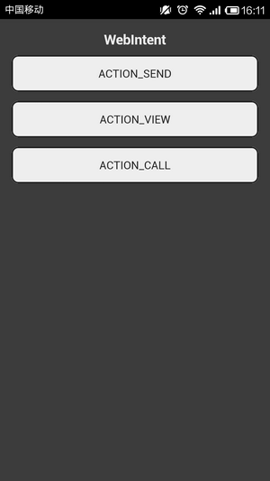
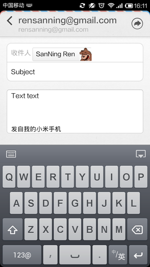
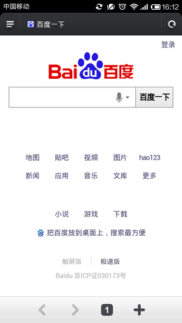
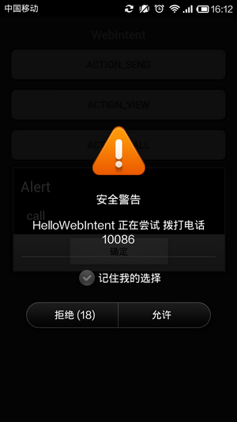

# Cordova 3.x 实用插件（4） -- Android 的 SEND、VIEW、CALL（WebIntent）

插件地址：[https://github.com/Initsogar/cordova-webintent](https://github.com/Initsogar/cordova-webintent) 

（1）创建工程 

**引用**

```
cordova create HelloWebIntent com.rensanning.cordova HelloWebIntent 
cd HelloWebIntent 
cordova platform add android
```

（2）安装 plugin 

**引用**

```
cordova plugin add https://github.com/Initsogar/cordova-webintent.git
```


（3）修改 index.html 后编译执行 

Html **代码**

```
<a href="#" class="btn" id="send">ACTION_SEND</a>
<a href="#" class="btn" id="view">ACTION_VIEW</a>
<a href="#" class="btn" id="call">ACTION_CALL</a>

<script type="text/javascript" src="cordova.js"></script>
<script type="text/javascript" src="js/jquery-1.11.0.min.js"></script>
<script type="text/javascript">
  $(document).on('deviceready', function() {
      $('#send').on('click', send);
      $('#view').on('click', view);
      $('#call').on('click', call);
  });

  function send() {
    alert("send");
    var extras = {};
    extras[window.plugins.webintent.EXTRA_EMAIL] = "rensanning@gmail.com";
    extras[window.plugins.webintent.EXTRA_SUBJECT] = "Subject";
    extras[window.plugins.webintent.EXTRA_TEXT] = "Text text";
    //extras[WebIntent.EXTRA_STREAM] = "file:///android_asset/www/index.html";
    window.plugins.webintent.startActivity({
      action: window.plugins.webintent.ACTION_SEND,
      type: 'text/plain',
      extras: extras},
      function() {},
      function() {alert('Failed to send email via Android Intent');}
    );
  }

  function view() {
    alert("view");
    window.plugins.webintent.startActivity({
      action: window.plugins.webintent.ACTION_VIEW,
      url: 'http://www.baidu.com'},
      function() {},
      function() {alert('Failed to open URL via Android Intent');}
    );
  }

  function call() {
    alert("call");
    window.plugins.webintent.startActivity({
      action: window.plugins.webintent.ACTION_CALL,
      url: 'tel:10086'},
      function() {},
      function() {alert('Failed to Call TEL via Android Intent');}
    );
  }
</script>
```



  





