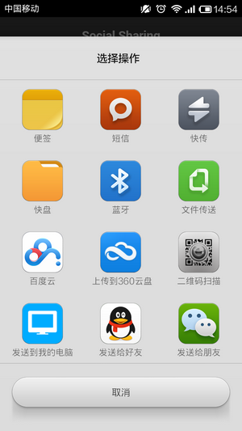
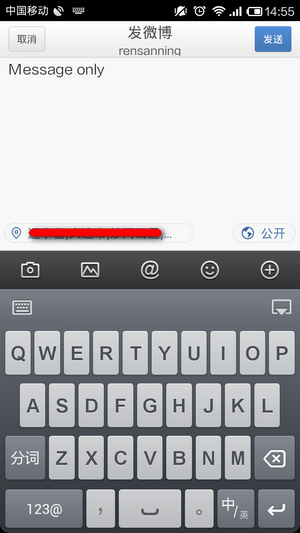
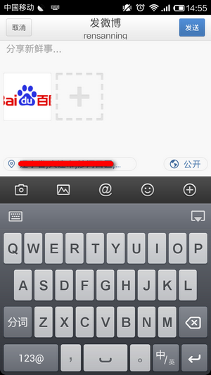
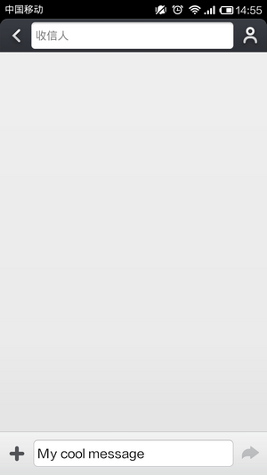

# Cordova 3.x 实用插件（3） -- 社交分享 SocialSharing

插件地址：[https://github.com/EddyVerbruggen/SocialSharing-PhoneGap-Plugin](https://github.com/EddyVerbruggen/SocialSharing-PhoneGap-Plugin) 

（1）创建工程 

**引用**

```
cordova create HelloSocialSharing com.rensanning.cordova HelloSocialSharing 
cd HelloSocialSharing 
cordova platform add android
```

（2）安装 plugin 

**引用**

```
cordova plugin add https://github.com/EddyVerbruggen/SocialSharing-PhoneGap-Plugin.git
```

（3）修改 index.html 后编译执行 

Html **代码**

```
<a href="#" class="btn" onclick="window.plugins.socialsharing.share('Message only')">Share Message</a>
<a href="#" class="btn" onclick="window.plugins.socialsharing.share(null, null, 'http://www.baidu.com/img/bdlogo.gif', null)">Share Image</a>
<a href="#" class="btn" onclick="window.plugins.socialsharing.shareViaSMS('My cool message', null, function(msg) {console.log('ok: ' + msg)}, function(msg) {alert('error: ' + msg)})">Share via SMS</a>
```

  

  

