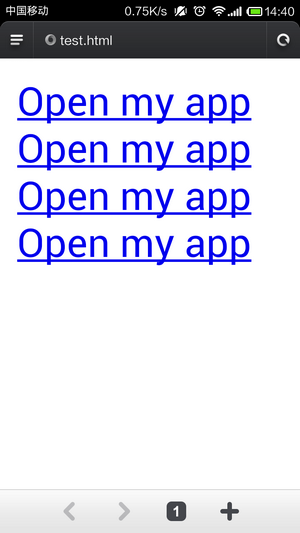

# Cordova 3.x 实用插件（5） -- 通过自定义 URL Scheme 启动你的 APP

通过 URL Scheme 来启动 APP 是一种很常见的做法，比如： 

系统程序：   
tel:1-408-555-5555   
sms:1-408-555-1212   
mailto:frank@wwdcdemo.example.com   

应用市场：   
Google Play   
market://details?id=your.package.name   
Amazon Appstore   
amzn://apps/android?p=your.package.name   

常用软件：   
sinaweibo://   
renren://   
youku://   
mqq://   
weixin://   
taobao://   
twitter://   
fb://   
youtube://   

等等还有很多。可以参考[这里](http://www.zhihu.com/question/19907735)，[这里](http://wiki.akosma.com/IPhone_URL_Schemes)。 

Twitter 就收集了很多基于 URI-Sheme，在客户端就会通过 canOpenURL 方法来检测用户安装的 App 列表，可以在 [TwitAppCheck](http://epirat.github.io/TwitAppCheck/#/) 看到 Twitter 到底检测了哪些 App。这里的可能更全：[https://gist.github.com/genadyo/295a5e8f0d743f57137f](https://gist.github.com/genadyo/295a5e8f0d743f57137f) 

插件地址：[https://github.com/EddyVerbruggen/LaunchMyApp-PhoneGap-Plugin](https://github.com/EddyVerbruggen/LaunchMyApp-PhoneGap-Plugin) 

（1）创建工程 

**引用**

```
cordova create LaunchMyApp com.rensanning.cordova LaunchMyApp 
cd LaunchMyApp 
cordova platform add android
```

（2）安装 plugin 

**引用**

```
cordova plugin add https://github.com/EddyVerbruggen/LaunchMyApp-PhoneGap-Plugin.git --variable URL_SCHEME=mycoolapp
```

（3）编译后安装到手机上 

**引用**

```
cordova build
```


（4）新建一个测试页面，通过手机浏览器打开后，点击 Link 即可启动你的 APP 了。 

Html **代码**

```
<!doctype html>
<html lang="en">
<body>
<a href="mycoolapp://">Open my app</a><br/>
<a href="mycoolapp://somepath">Open my app</a><br/>
<a href="mycoolapp://somepath?foo=bar">Open my app</a><br/>
<a href="mycoolapp://?foo=bar">Open my app</a><br/>
</body>
</html>
```




